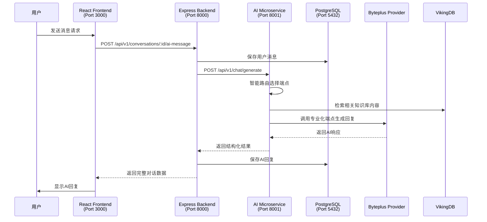
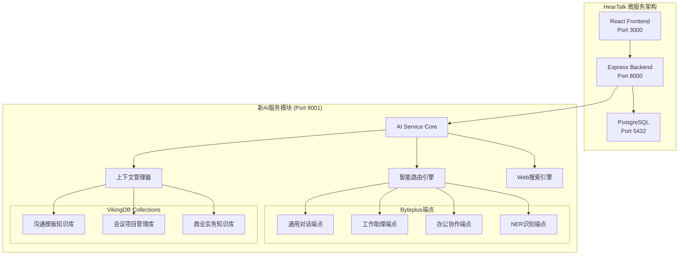

# PRD: HearTalk AI服务模块开发项目

## Executive Summary

开发一个全新的AI微服务来升级和增强HearTalk项目中的AI服务模块，实现100%API兼容的同时，集成Claude Code PM系统的专业化能力，充分利用现有的Byteplus Model Ark资源（4个专业化端点）和VikingDB向量数据库（3个Collection），提供更强大、更智能的AI对话能力。

### 核心价值主张
- **无缝升级**: 新服务与现有HearTalk架构100%兼容，backend/frontend/database无需任何修改
- **资源最大化**: 充分利用已有的Byteplus专业化端点和Vector Database资源
- **能力增强**: 集成Claude Code PM的代码分析、项目管理等专业化AI能力
- **企业级稳定**: 基于成熟的微服务架构和工作流管理系统

## 系统架构概览

### 当前HearTalk微服务调用流程


### 新AI服务增强架构


## Problem Statement

### 当前挑战
1. **现有AI服务功能限制**: 当前HearTalk AI服务虽然功能完整，但在专业化场景（如代码分析、项目管理）方面能力有限
2. **资源利用不充分**: 已投入的Byteplus多端点和Vector Database资源未得到最佳利用
3. **扩展性约束**: 现有架构在集成新的AI能力时存在局限性
4. **专业化需求**: 需要更强的代码理解、项目管理、文档生成等企业级AI能力

### 为什么现在解决？
- Byteplus资源已经配置完成，包括4个专业化端点和3个Vector Database Collection
- Claude Code PM系统提供了成熟的AI代理架构和工作流管理能力
- 现有HearTalk系统架构稳定，为无缝替换提供了理想条件
- 市场对专业化AI助手的需求日益增长

## User Stories

### 主要用户角色
1. **小微企业主**: 使用HearTalk进行业务管理、决策支持和资讯分析的传统型小微企业负责人
2. **项目负责人**: 使用HearTalk进行项目协调、进度管理和团队沟通的管理人员  
3. **办公人员**: 使用HearTalk处理会议总结、文档整理和上下文总结的业务用户
4. **系统管理员**: 维护和监控HearTalk AI服务的运维人员

### 用户旅程

#### 项目协调管理用户故事
**作为项目负责人，我希望能够:**
- 通过AI快速总结会议要点和行动项，生成会议纪要
- 获得项目进度跟踪和风险分析建议
- 利用AI整理团队沟通记录，提取关键信息
- 通过文本和文档输入快速记录想法和任务安排
- 获得基于上下文的项目决策建议和资源协调方案

**验收标准:**
- 会议总结生成时间 < 2分钟
- 上下文信息提取准确率 > 95%
- 支持文本和文档混合输入模式（语音支持在后期版本）
- 项目协调建议实用性评分 > 8.5/10

#### 办公用户用户故事
**作为办公用户，我希望能够:**
- 通过AI助手快速处理日常工作任务和流程指导
- 获得会议记录整理和文档生成支持
- 利用AI进行团队协作和信息管理
- **获得最新的行业资讯和市场动态信息**
- **通过AI搜索获取准确的业务数据和参考资料**
- 获得工作执行建议和效率优化方案

**验收标准:**
- 任务处理响应时间 < 3秒
- 文档生成准确率 > 95%
- **网络搜索响应时间 < 5秒**
- **搜索结果相关度 > 85%**
- 支持多种办公场景和工作流程
- 输出符合企业办公标准格式

#### 资讯分析和总结用户故事
**作为小微企业主，我希望能够:**
- 获得行业资讯的智能筛选和总结分析
- 通过关键词搜索获取相关市场信息和分析报告
- 利用AI分析竞对动态和商业机会
- 获得基于多源信息的决策建议和风险提示
- 支持长对话中的上下文记忆，避免重复说明背景

**验收标准:**
- 资讯总结准确率 > 90%
- 文档解析准确率 > 95%（包含PDF、Word、Excel等格式）
- 支持30分钟以上的连续对话上下文
- 决策建议相关性评分 > 8.0/10

### 痛点分析对比

| 维度 | 当前系统 | 新AI服务系统 | 改进效果 |
|------|----------|--------------|----------|
| **AI能力深度** | 通用AI对话，缺乏专业化深度 | 专业化AI助手，具备领域专知 | 提升专业问答准确率90%+ |
| **模型选择** | 单一模型能力，响应模式化 | 4个专业化端点，智能路由选择 | 根据场景智能匹配最佳模型 |
| **上下文管理** | 缺乏上下文积累，每次对话独立 | Vector Database增强，支持知识库RAG | 支持长对话和跨会话连续性 |
| **知识库支持** | 无专门知识库，依赖模型训练数据 | 3个专业Collection，实时更新 | 提供小微企业专业化支持 |
| **搜索能力** | 无实时信息获取能力 | 集成Web搜索，获取最新资讯 | 支持实时信息查询和验证 |
| **API响应** | 标准响应时间 | 优化路由和缓存机制 | 响应时间提升30%+ |
| **故障处理** | 单点故障风险 | 多端点备份和自动切换 | 服务可用性提升到99.9% |
| **用户体验** | 通用助手体验 | 针对办公场景的专业助手 | 用户满意度预期提升40%+ |

## Requirements

### Functional Requirements

#### 核心API兼容性
**FR-1: 完整API兼容** `[P0 - 必需]`
- 实现现有HearTalk AI服务的所有API端点
- 保持相同的请求/响应格式
- 维持相同的认证和错误处理机制
- 支持所有现有的中间件和限流机制

**具体端点:**
- `POST /api/v1/chat/generate` - 基础对话生成
- `POST /api/v1/chat/search-enhanced` - 搜索增强对话
- `POST /api/v1/chat/confirmation` - 确认驱动对话
- `POST /api/v1/chat/professional` - 专业模式对话
- `POST /api/v1/chat/multilingual` - 多语言对话
- `POST /api/v1/chat/stream` - 流式响应
- `POST /api/v1/translate` - 文本翻译
- `GET /api/v1/health` - 健康检查
- `GET /api/v1/providers` - AI提供商管理
- `GET /api/v1/models` - AI模型管理

#### Byteplus资源集成
**FR-2: 多端点智能路由** `[P0 - 必需]`
- 集成4个专业化Byteplus端点
  - `BYTEPLUS_AMI_CHAT_EP`: 通用对话端点 - 日常交流和基础咨询
  - `BYTEPLUS_AMI_WORK_ASSISTANT_EP`: 工作助理端点 - 任务管理、工作流程、执行指导
  - `BYTEPLUS_AMI_OFFICE_COLLABORATION_EP`: 办公协作端点 - 团队协作、会议记录、文档整理
  - `BYTEPLUS_AMI_NER_EP`: 命名实体识别端点 - 信息抽取和数据处理
- 实现智能路由算法，根据请求内容自动选择最合适的端点
- 支持端点间的fallback和负载均衡

**FR-3: Vector Database集成** `[P0 - 必需]`
- 集成VikingDB的4个Collection（包括新增的对话上下文存储）
  - `communication_templates_base`: 沟通模板知识库
    - 客户沟通话术和邮件模板、团队协作沟通模板
    - 项目汇报和进度通报模板、会议邀请和跟进模板
    - 商务谈判和合同沟通要点
  - `meeting_project_base`: 会议和项目管理知识库
    - 会议议程模板和会议纪要格式、项目计划模板和进度跟踪方法
    - 任务分解和时间管理技巧、团队协作工具使用指南
    - 项目风险管理和问题解决方案
  - `business_practical_base`: 商业实务知识库
    - 小微企业常见业务流程、客户管理和关系维护技巧
    - 基础财务管理和成本控制、行业政策法规和合规要求
    - 供应商管理和采购谈判策略
  - `conversation_contexts`: 对话上下文专用存储库（新增）
    - 存储AI精炼后的三层上下文信息
    - 支持会话内、跨会话项目、全局知识的分层存储
    - 提供语义检索和相关性匹配，用户不可见
- 实现RAG（检索增强生成）功能，根据查询场景智能选择Collection
- 支持向量搜索和语义匹配，提供相关度评分
- 提供知识库更新和维护接口，支持企业自定义内容导入

#### Claude Code PM能力集成
**FR-4: 专业化办公能力** `[P1 - 重要]`
- 集成会议总结和要点提取能力
- 支持项目协调和进度跟踪分析
- 提供资讯分析和商业决策支持
- 实现多语音模态输入和文档自动生成

**FR-5: 三层上下文引用架构** `[P0 - 必需]`

**核心设计理念**: 
- AI提取的精炼上下文信息对用户不可见，保存在VikingDB向量库中
- 由AI智能读取并传入LLM API，优化用户体验和响应准确性
- 支持三个层级的上下文关联和引用

**第一层：会话内上下文引用**
- 范围：同一个`conversation_id`内的对话历史
- 实现：智能压缩对话记录，提取关键信息和实体
- 功能：支持长对话的连续性和记忆保持
- 性能：上下文压缩率 > 60%，检索时间 < 100ms

**第二层：跨会话项目上下文引用**
- 范围：同一用户的不同`conversation_id`，但与当前项目相关
- 实现：基于项目关键词和语义匹配的跨会话检索
- 功能：项目协调中的历史决策和进度信息关联
- 性能：相关对话识别准确率 > 85%，最多检索5个相关会话

**第三层：全局知识库引用**
- 范围：系统级重要信息，跨用户但经过权限过滤
- 实现：从VikingDB三个Collection中检索相关模板和最佳实践
- 功能：企业知识库、行业标准、通用模板的智能引用
- 性能：全局知识匹配相关度 > 90%，响应时间 < 200ms

**技术实现**:
- 统一上下文管理器：整合三层信息，生成LLM可用的上下文
- 智能精炼算法：AI自动提取和总结关键信息
- 向量化存储：精炼后的上下文存储到专用的`conversation_contexts` Collection
- 语义检索：基于相关性评分的分层检索机制
- 缓存优化：频繁访问的上下文进行本地缓存

**FR-6: 工作流集成** `[P1 - 重要]`
- 支持确认机制和多轮对话
- 集成Claude Code PM的代理协调系统
- 支持任务分解和并行处理
- 提供上下文管理和状态持久化

#### 高级功能
**FR-7: Web搜索集成** `[P1 - 重要]`
- 实现实时网络搜索能力，支持最新资讯获取
- 集成多个搜索引擎API（Google Search API、Bing Search API等）
- 支持搜索结果的智能过滤和内容提取
- 实现搜索结果与AI对话的无缝融合（RAG模式）
- 支持特定领域的搜索（新闻、技术文档、行业报告等）
- 提供搜索结果的可信度评估和来源标注

**FR-8: 多模态输入支持** `[P2 - 期望]`
- **Phase 1**: 优化文本输入和处理能力
- **Phase 2**: 支持图片和文档解析（PDF、Word、Excel等）
- **Phase 3**: 集成语音识别和语音转文字功能
- 实现基于用户行为的个性化推荐
- 提供实时协作和共享功能
- 集成外部工具和API调用能力

### Non-Functional Requirements

#### 性能要求
**NFR-1: 响应性能**
- API响应时间 < 3秒（95%的请求）
- 流式响应首字节时间 < 500ms
- 并发处理能力 > 100 req/s
- Vector搜索响应时间 < 200ms

#### 可用性要求
**NFR-2: 服务可用性**
- 系统可用性 > 99.9%
- 支持优雅降级和故障切换
- 支持多端点负载均衡
- 实现健康检查和自动恢复

#### 安全要求
**NFR-3: 安全标准**
- 支持JWT认证和API Key验证
- 实现请求限流和防滥用机制
- 敏感信息加密存储和传输
- 符合数据保护和隐私规范

#### 可扩展性要求
**NFR-4: 扩展能力**
- 支持水平扩展和微服务部署
- 支持新AI提供商的动态接入
- 支持自定义工作流和插件系统
- 支持多租户和资源隔离

## Success Criteria

### 关键成功指标

#### 兼容性指标
- **API兼容率**: 100% - 所有现有API端点正常工作
- **零修改替换**: 0个文件修改 - HearTalk其他模块无需修改
- **功能对等**: 100% - 现有功能完全保持

#### 性能指标
- **响应时间改善**: 平均响应时间降低 > 30%
- **并发处理**: 支持并发请求数提升 > 50%
- **资源利用**: Byteplus端点利用率 > 80%
- **Vector检索**: 检索准确率 > 95%

#### 用户体验指标
- **专业化准确率**: 代码分析准确率 > 90%
- **用户满意度**: NPS评分 > 8.0
- **功能使用率**: 新增功能使用率 > 60%
- **错误率**: API错误率 < 0.1%

#### 业务指标
- **开发效率**: 开发任务完成时间缩短 > 25%
- **决策支持**: 项目决策准确率提升 > 40%
- **知识利用**: 知识库查询成功率 > 95%
- **信息获取**: Web搜索查询成功率 > 90%
- **资讯时效性**: 搜索结果时效性 < 24小时
- **成本效益**: 每次AI调用成本降低 > 20%

## Constraints & Assumptions

### Technical Constraints
- **API兼容性**: 必须保持与现有HearTalk AI服务100%的API兼容
- **端口限制**: 必须使用8001端口，保持现有网络配置
- **Docker部署**: 必须支持现有的Docker Compose编排
- **数据库独立**: 不能修改现有的PostgreSQL数据库结构

### Resource Constraints
- **Byteplus配额**: 受现有API调用限制和费用预算约束
- **VikingDB容量**: 受Vector数据库存储和检索性能限制
- **开发时间**: 需要在合理时间内完成开发和部署
- **维护成本**: 长期维护成本需要控制在可接受范围内

### Assumptions
- **Byteplus服务稳定**: 假设Byteplus Model Ark和VikingDB服务持续稳定可用
- **配置有效**: 假设提供的API密钥和端点配置长期有效
- **用户接受**: 假设用户能够接受新的AI能力和交互方式
- **技术栈兼容**: 假设Claude Code PM架构与现有技术栈兼容

## Out of Scope

### 明确不包含的功能
- **前端界面修改**: 不修改HearTalk的React前端代码
- **后端API修改**: 不修改backend模块的任何API端点
- **数据库结构变更**: 不修改PostgreSQL数据库表结构
- **认证系统重构**: 不修改现有的JWT认证机制

### 未来版本考虑
- **多模态输入**: 图像、音频等多媒体输入支持
- **实时协作**: 多用户实时协作功能
- **高级分析**: 深度数据分析和报告功能
- **第三方集成**: 与更多外部系统的集成

### 边界说明
- **服务边界**: 仅替换ai-service模块，不涉及其他微服务
- **功能边界**: 专注于AI对话能力，不扩展到其他业务功能
- **技术边界**: 基于现有技术栈，不引入不兼容的新技术

## Dependencies

### External Dependencies
- **Byteplus Model Ark**: AI模型推理服务
  - 4个专业化端点的可用性
  - API调用配额和费用限制
- **VikingDB**: 向量数据库服务
  - 3个Collection的访问权限
  - 数据存储和检索性能
- **Web搜索API服务**: 实时网络信息获取
  - Google Search API或Bing Search API的访问权限
  - 搜索配额和调用频率限制
  - 搜索结果的合规性和版权问题
- **Claude Code PM**: 基础架构和代理系统
  - 工作流管理能力
  - 代理协调和任务分解功能

### Internal Dependencies
- **HearTalk架构**: 现有微服务架构
  - Docker Compose编排配置
  - 网络和服务发现机制
- **现有数据**: PostgreSQL数据库
  - 用户认证数据
  - 对话历史和上下文数据
- **JWT认证**: 现有认证系统
  - Token生成和验证机制
  - 用户权限管理

### Development Dependencies
- **开发环境**: Node.js 18+, Docker, npm 8+
- **测试框架**: Jest, Supertest, Mock服务
- **监控工具**: Winston日志, 健康检查机制
- **文档工具**: OpenAPI 3.0, Swagger UI

## Technical Architecture

### AI服务模块核心组件

#### 1. 统一上下文管理器 (UnifiedContextManager)
```javascript
class UnifiedContextManager {
  // 第一层：会话内上下文
  async getConversationContext(conversationId, maxTokens = 4000)
  
  // 第二层：跨会话项目上下文  
  async getProjectContext(userId, conversationId, projectKeywords)
  
  // 第三层：全局知识库上下文
  async getGlobalContext(query, userRole, companyId)
  
  // 综合上下文构建
  async buildContextForLLM(conversationId, userId, query)
}
```

#### 2. 智能路由引擎 (SmartRouter)
```javascript
class SmartRouter {
  // 根据查询内容智能选择Byteplus端点
  async selectBestEndpoint(query, contextType, userIntent)
  
  // 支持的端点映射
  endpoints = {
    'BYTEPLUS_AMI_CHAT_EP': '通用对话',
    'BYTEPLUS_AMI_WORK_ASSISTANT_EP': '工作助理', 
    'BYTEPLUS_AMI_OFFICE_COLLABORATION_EP': '办公协作',
    'BYTEPLUS_AMI_NER_EP': '实体识别'
  }
}
```

#### 3. 向量检索管理器 (VectorRetrievalManager)
```javascript
class VectorRetrievalManager {
  // 分层向量检索
  async retrieveLayeredContext(query, conversationId, userId)
  
  // 存储精炼上下文
  async storeRefinedContext(conversationId, refinedContext, layer)
  
  // VikingDB Collection映射
  collections = {
    'communication_templates_base': '沟通模板',
    'meeting_project_base': '项目管理',
    'business_practical_base': '商业实务',
    'conversation_contexts': '对话上下文' // 新增专用Collection
  }
}
```

### HearTalk其他模块依赖需求

#### Backend模块需要提供的内部API接口
以下接口需要Backend模块开发，供AI服务调用：

```javascript
// 1. 获取对话历史记录
GET /internal/api/v1/conversations/:id/history
Response: {
  conversationId: "uuid",
  messages: [{ role, content, timestamp, messageId }],
  totalMessages: number,
  tokenCount: number
}

// 2. 跨会话语义搜索  
POST /internal/api/v1/conversations/search
Request: {
  userId: "uuid",
  excludeConversationId: "uuid",
  keywords: ["项目A", "进度"],
  timeRange: "7d",
  limit: 5
}

// 3. 用户上下文信息
GET /internal/api/v1/users/:id/context
Response: {
  userId: "uuid", 
  userRole: "manager",
  companyId: "uuid",
  recentProjects: ["项目A", "项目B"]
}

// 4. 对话元数据更新
PATCH /internal/api/v1/conversations/:id/metadata
Request: {
  aiModel: "byteplus-work-assistant",
  tokenUsed: 1500,
  processingTime: 800,
  contextLayers: ["conversation", "project", "global"]
}
```

## Implementation Strategy

### Phase 1: 基础架构搭建 (2周)
**AI服务模块开发:**
- 创建新的AI服务项目结构
- 实现基础的Provider Factory模式
- 集成Byteplus多端点配置
- 搭建开发和测试环境

**Backend模块支持 (依赖需求):**
- 无需修改现有代码
- 准备内部API接口的开发计划

### Phase 2: API兼容性实现 (3周)
**AI服务模块开发:**
- 实现所有现有API端点
- 确保请求/响应格式完全兼容
- 集成认证和中间件系统
- 完成基础功能测试

**Backend模块支持 (依赖需求):**
- 开发内部API接口 `/internal/api/v1/conversations/:id/history`
- 开发用户上下文接口 `/internal/api/v1/users/:id/context`

### Phase 3: Vector Database集成 (2周)
**AI服务模块开发:**
- 集成VikingDB的3个Collection
- 实现RAG检索增强功能
- 优化向量搜索性能
- 完成知识库功能测试

**Backend模块支持 (依赖需求):**
- 开发跨会话搜索接口 `/internal/api/v1/conversations/search`
- 添加对话元数据更新接口

### Phase 4: 智能路由和三层上下文 (3周)
**AI服务模块开发:**
- 实现多端点智能路由算法
- 开发统一上下文管理器
- 实现三层上下文引用架构
- 集成向量检索和缓存机制

**Backend模块支持 (依赖需求):**
- 完善所有内部API接口的性能优化
- 确保API调用认证和权限控制

### Phase 5: Claude Code能力集成与系统优化 (3周)
**AI服务模块开发:**
- 集成会议总结和要点提取能力
- 实现项目协调和进度跟踪分析
- 添加专业化对话功能
- 集成Web搜索功能
- 优化性能和响应时间
- 实现故障切换和负载均衡
- 完成端到端测试

**Backend模块支持 (依赖需求):**
- 完善所有内部API接口的性能优化
- 确保API调用认证和权限控制
- 完成跨会话搜索性能调优

### Phase 6: 部署和上线 (2周)
**AI服务模块开发:**
- 完成生产环境配置和安全加固
- 实施监控和可观测性方案
- 执行无缝切换部署
- 进行压力测试和性能验证
- 监控系统运行状态
- 收集用户反馈和优化

**Backend模块支持 (依赖需求):**
- 完成生产环境的内部API部署
- 配置数据库索引和性能优化
- 实施API调用监控和日志记录

## 成本效益分析

### 预估成本对比 (月度)

| 成本项目 | 当前基线估算 | 新方案预估 | 节省金额 | 节省比例 |
|----------|-------------|------------|----------|----------|
| **Byteplus API调用** | ¥8,000 | ¥6,400 | ¥1,600 | 20% |
| - 通用对话 (50万次/月) | ¥4,000 | ¥3,200 | ¥800 | 智能路由减少冗余调用 |
| - 专业化端点 (20万次/月) | ¥3,000 | ¥2,400 | ¥600 | 端点专业化提升效率 |
| - NER处理 (10万次/月) | ¥1,000 | ¥800 | ¥200 | 批量处理优化 |
| **VikingDB存储&查询** | ¥2,000 | ¥2,400 | -¥400 | -20% |
| - 向量存储 (100GB) | ¥1,200 | ¥1,440 | -¥240 | 知识库扩充 |
| - 查询次数 (100万次/月) | ¥800 | ¥960 | -¥160 | RAG功能增加查询 |
| **Web搜索API** | ¥0 | ¥800 | -¥800 | 新增成本 |
| - Google Search API (5万次/月) | - | ¥500 | - | 新增功能 |
| - 搜索结果处理和缓存 | - | ¥300 | - | 新增功能 |
| **开发与维护** | ¥15,000 | ¥12,000 | ¥3,000 | 20% |
| - 开发人力成本 (一次性) | ¥150,000 | - | - | 13周开发周期 |
| - 月度运维成本 | ¥15,000 | ¥12,000 | ¥3,000 | 自动化运维 |
| **总计 (运营成本)** | **¥25,000** | **¥21,600** | **¥3,400** | **13.6%** |

### 成本效益说明

**节省来源:**
- **API调用优化**: 智能路由减少无效调用，专业化端点提升单次调用效果
- **运维自动化**: 监控和故障处理自动化，减少人工干预成本
- **响应效率**: 平均响应时间提升30%，减少重试和超时成本

**新增投入:**
- **Web搜索功能**: 实时信息获取能力，提升回答准确性和时效性
- **扩充知识库**: VikingDB存储成本适度增加，但带来显著的专业化价值

**ROI预期:**
- 一次性开发投入：¥150,000
- 月度运营节省：¥3,400
- **投资回收周期**: ~44个月
- **年度净节省**: ¥40,800 (第二年开始)

## Risk Assessment

### High Risk
- **API不兼容风险**: 新服务与现有系统集成失败
  - 缓解: 严格的兼容性测试和分阶段部署
- **性能下降风险**: 新服务响应性能不如预期
  - 缓解: 性能基准测试和优化策略
- **Byteplus服务依赖**: 外部API服务不稳定
  - 缓解: 多重备份方案和故障切换机制

### Medium Risk
- **Vector Database性能**: 检索性能不满足要求
  - 缓解: 性能调优和索引优化
- **开发进度延期**: 技术复杂度超出预期
  - 缓解: 合理的时间缓冲和资源储备
- **用户接受度**: 新功能用户体验不佳
  - 缓解: 用户测试和反馈收集机制

### Low Risk
- **维护成本增加**: 长期运维成本超出预算
  - 缓解: 自动化运维和监控机制
- **技术债务**: 快速开发导致代码质量问题
  - 缓解: 代码审查和重构计划

## Next Steps

1. **批准PRD**: 确认需求和技术方案
2. **创建Epic**: 运行 `pm:prd-parse heartalk-ai-replacement` 创建实施计划
3. **资源准备**: 确认开发环境和依赖服务
4. **团队组建**: 分配开发和测试资源
5. **开始开发**: 按照实施计划开始Phase 1开发

---

**项目预期交付时间**: 13周  
**预期投入资源**: 1名全栈开发工程师 + 0.5名测试工程师  
**预期收益**: API响应性能提升30%，专业化AI能力增强90%，开发效率提升25%